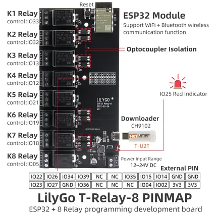

# T-Relay-8

**LILYGO** · ESP32 original

Revision: Not identified  
Coverage: Pinout image collected

[Browse all manufacturers](../../../../BROWSE.md) · [Desktop app](https://github.com/valleytechsolutions/black-wire-desktop)

## Board pin map

**pinout image** · Reviewed source · JPG

[Open original reference](../../../../library/media/a6a8aed1da40ef30653d92ac73d3aa139e908c90f25bd0c36460d034522bfbf4.jpg)

**Credit and rights:** Not established; source attribution retained. Source/manufacturer: LILYGO.

[Source 1](https://wiki.lilygo.cc/products/t-relay-series/t-relay/index/image/t-relay-pinout.jpg) · [Source 2](https://wiki.lilygo.cc/products/t-relay-series/t-relay/)

Manufacturer image preserved. Match the depicted board and revision before use. Source page name: T-Relay. Saved model name follows the printed diagram.

SHA-256: `a6a8aed1da40ef30653d92ac73d3aa139e908c90f25bd0c36460d034522bfbf4`

Pin assignments have not been independently electrically verified. Check board revision before wiring.
