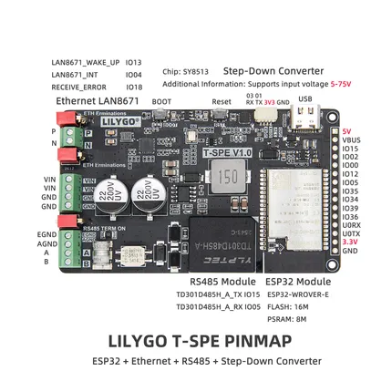

# T-Spe

**LILYGO** · ESP32 original

Revision: Not identified  
Coverage: Pinout image collected

[Browse all manufacturers](../../../../BROWSE.md) · [Desktop app](https://github.com/valleytechsolutions/black-wire-desktop)

## Board pin map

**pinout image** · Reviewed source · JPG

[Open original reference](../../../../library/media/430abe183d5e67c8096a3b21453bd74734ad647fcddcaaaf8d102bbc377e2a98.jpg)

**Credit and rights:** Not established; source attribution retained. Source/manufacturer: LILYGO.

[Source 1](https://wiki.lilygo.cc/products/industrial-series/t-spe/index/image/t-spe-pin.jpg) · [Source 2](https://wiki.lilygo.cc/products/industrial-series/t-spe/)

Manufacturer image preserved. Match the depicted board and revision before use.

SHA-256: `430abe183d5e67c8096a3b21453bd74734ad647fcddcaaaf8d102bbc377e2a98`

Pin assignments have not been independently electrically verified. Check board revision before wiring.
