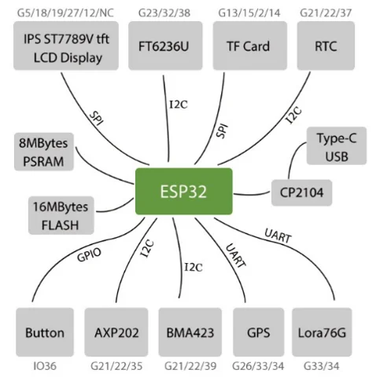

# T-Watch 2019

**LILYGO** · ESP32 original

Revision: 2019 platform; peripheral options vary  
Coverage: Supporting reference collected; complete physical pinout needed

[Browse all manufacturers](../../../../BROWSE.md) · [Devices & IoT](../../../../DEVICES.md) · [Open in the browser guide](https://valleytech-black-wire-guide.pages.dev/?board=lilygo-gpio-device-t-watch-2019)

Device category: **Wearables**

## Peripheral GPIO relationship diagram

**GPIO reference image** · Reviewed source · PNG

[Open original reference](../../../../library/media/80e4729a83b705a884295fb3d16562dacefe347b87fd9838d4f1700e87d32f52.png)

**Credit and rights:** Not established; source attribution retained. Source/manufacturer: LILYGO.

[Source 1](https://raw.githubusercontent.com/Xinyuan-LilyGO/TTGO_TWatch_Library/e5a0f825a21198f97d2bafee03ea853766483d20/images/pins.png) · [Source 2](https://github.com/Xinyuan-LilyGO/TTGO_TWatch_Library)

Legacy T-Watch library GPIO/peripheral block diagram. This shows signal relationships, not the physical location of every connector. Not applicable to T-Watch S3 or Ultra.

Image revision: 2019 platform; peripheral options vary

SHA-256: `80e4729a83b705a884295fb3d16562dacefe347b87fd9838d4f1700e87d32f52`

Pin assignments have not been independently electrically verified. Check board revision before wiring.
