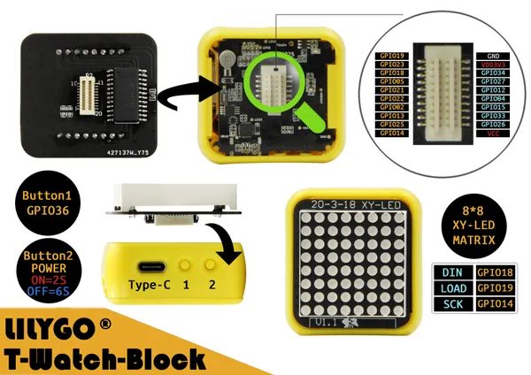

# T-Watch Block LED

**LILYGO** · ESP32 original

Revision: Not identified  
Coverage: Partial pinout collected; full reference still needed

[Browse all manufacturers](../../../../BROWSE.md) · [Devices & IoT](../../../../DEVICES.md) · [Open in the browser guide](https://valleytech-black-wire-guide.pages.dev/?board=lilygo-gpio-device-t-watch-block-led)

Device category: **Wearables**

## TBlock_LED

**pinout image** · Reviewed source · JPG

[Open original reference](../../../../library/media/26e53838bc36a64f2dfda737c152e2f11d4bc639ba0dc6afdf18108ab34123a6.jpg)

**Credit and rights:** Not established; source attribution retained. Source/manufacturer: LILYGO.

[Source 1](https://raw.githubusercontent.com/Xinyuan-LilyGO/T-Block/511c8e206a6bde98a52f0455368ea7dadf9d011f/img/TBlock_LED.jpg) · [Source 2](https://github.com/Xinyuan-LilyGO/T-Block/blob/511c8e206a6bde98a52f0455368ea7dadf9d011f/img/TBlock_LED.jpg)

Original manufacturer diagram. Shown module, radio, display and power-system options must match the board.

Image revision: Not identified

SHA-256: `26e53838bc36a64f2dfda737c152e2f11d4bc639ba0dc6afdf18108ab34123a6`

Pin assignments have not been independently electrically verified. Check board revision before wiring.
