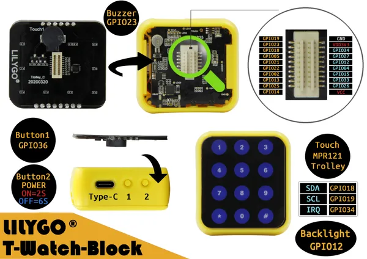

# T-Watch Block Touch

**LILYGO** · ESP32 original

Revision: Not identified  
Coverage: Partial pinout collected; full reference still needed

[Browse all manufacturers](../../../../BROWSE.md) · [Desktop app](https://github.com/valleytechsolutions/black-wire-desktop)

## TBlock_Touch

**pinout image** · Reviewed source · JPG

[Open original reference](../../../../library/media/dca5f6b7cc3917a79a1c4236e72477bf2e5042d82595f7d80a0bed97ab1f8630.jpg)

**Credit and rights:** Not established; source attribution retained. Source/manufacturer: LILYGO.

[Source 1](https://raw.githubusercontent.com/Xinyuan-LilyGO/T-Block/511c8e206a6bde98a52f0455368ea7dadf9d011f/img/TBlock_Touch.jpg) · [Source 2](https://github.com/Xinyuan-LilyGO/T-Block/blob/511c8e206a6bde98a52f0455368ea7dadf9d011f/img/TBlock_Touch.jpg)

Original manufacturer diagram. Shown module, radio, display and power-system options must match the board.

**Partial diagram. Confirm missing pins against the exact board documentation.**

SHA-256: `dca5f6b7cc3917a79a1c4236e72477bf2e5042d82595f7d80a0bed97ab1f8630`

Pin assignments have not been independently electrically verified. Check board revision before wiring.
