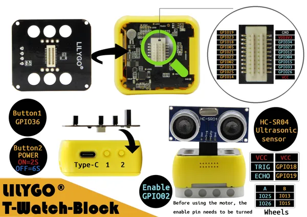

# T-Watch Block Ultrasonic

**LILYGO** · ESP32 original

Revision: Not identified  
Coverage: Partial pinout collected; full reference still needed

[Browse all manufacturers](../../../../BROWSE.md) · [Desktop app](https://github.com/valleytechsolutions/black-wire-desktop)

## TBlock_Chao

**pinout image** · Reviewed source · JPG

[Open original reference](../../../../library/media/94c026ef3ceb89aecfb1ebb77b86aece3a4fddc08adf5d5b69c9ec788c0eb222.jpg)

**Credit and rights:** Not established; source attribution retained. Source/manufacturer: LILYGO.

[Source 1](https://raw.githubusercontent.com/Xinyuan-LilyGO/T-Block/511c8e206a6bde98a52f0455368ea7dadf9d011f/img/TBlock_Chao.jpg) · [Source 2](https://github.com/Xinyuan-LilyGO/T-Block/blob/511c8e206a6bde98a52f0455368ea7dadf9d011f/img/TBlock_Chao.jpg)

Original manufacturer diagram. Shown module, radio, display and power-system options must match the board.

**Partial diagram. Confirm missing pins against the exact board documentation.**

SHA-256: `94c026ef3ceb89aecfb1ebb77b86aece3a4fddc08adf5d5b69c9ec788c0eb222`

Pin assignments have not been independently electrically verified. Check board revision before wiring.
