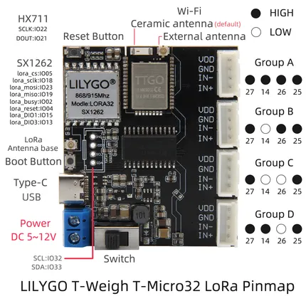

# T-Weigh

**LILYGO** · ESP32 original

Revision: Not identified  
Coverage: Pinout image collected

[Browse all manufacturers](../../../../BROWSE.md) · [Devices & IoT](../../../../DEVICES.md) · [Open in the browser guide](https://valleytech-black-wire-guide.pages.dev/?board=lilygo-esp32-t-weigh)

Device category: **Controllers & instruments**

## image1

**pinout image** · Reviewed source · JPG

[Open original reference](../../../../library/media/5bd15aaf7343861d450add2fd2d6285c517113165fc819539f6611179bf09692.jpg)

**Credit and rights:** Not established; source attribution retained. Source/manufacturer: LILYGO.

[Source 1](https://raw.githubusercontent.com/Xinyuan-LilyGO/T-Weigh/8a1ab405a79c1031d4dddb4bc6db7e8eacda8849/image/image1.jpg) · [Source 2](https://github.com/Xinyuan-LilyGO/T-Weigh/blob/8a1ab405a79c1031d4dddb4bc6db7e8eacda8849/image/image1.jpg)

Original manufacturer diagram. Shown module, radio, display and power-system options must match the board.

Image revision: Not identified

SHA-256: `5bd15aaf7343861d450add2fd2d6285c517113165fc819539f6611179bf09692`

Pin assignments have not been independently electrically verified. Check board revision before wiring.
