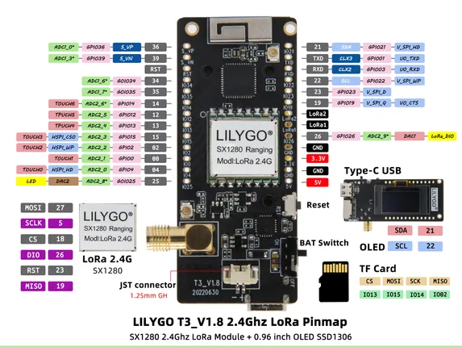

# T3 V1.8 SX1280 2.4GHz

**LILYGO** · ESP32 original

Revision: 2.4GHz LoRa; not the sub-GHz V1.6.1 map  
Coverage: Pinout image collected

[Browse all manufacturers](../../../../BROWSE.md) · [Desktop app](https://github.com/valleytechsolutions/black-wire-desktop)

## lora32_v1.8_pinmap

**pinout image** · Reviewed source · JPG

[Open original reference](../../../../library/media/af57d79070d015274ddfd3b6e5ca8e720d61134cd75433fcfd7edff43051fc2c.jpg)

**Credit and rights:** Not established; source attribution retained. Source/manufacturer: LILYGO.

[Source 1](https://raw.githubusercontent.com/Xinyuan-LilyGO/LilyGo-LoRa-Series/5e2da3f519a25e91b9b14c3071e36a568bbd949d/assets/image/lora32_v1.8_pinmap.jpg) · [Source 2](https://github.com/Xinyuan-LilyGO/LilyGo-LoRa-Series/blob/5e2da3f519a25e91b9b14c3071e36a568bbd949d/assets/image/lora32_v1.8_pinmap.jpg)

2.4GHz LoRa; not the sub-GHz V1.6.1 map

SHA-256: `af57d79070d015274ddfd3b6e5ca8e720d61134cd75433fcfd7edff43051fc2c`

Pin assignments have not been independently electrically verified. Check board revision before wiring.
