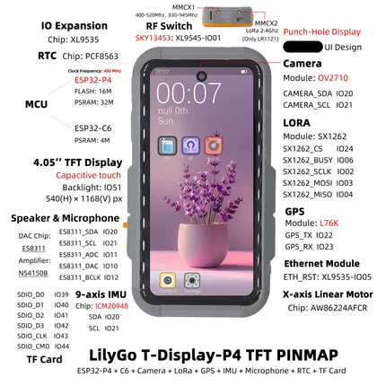

# T-Display P4 TFT

**LILYGO** · ESP32-P4

Revision: Not identified  
Coverage: Pinout image collected

[Browse all manufacturers](../../../../BROWSE.md) · [Devices & IoT](../../../../DEVICES.md) · [Open in the browser guide](https://valleytech-black-wire-guide.pages.dev/?board=lilygo-esp32-t-display-p4-tft)

Device category: **Displays & HMI**

## Board pin map

**pinout image** · Reviewed source · JPG

[Open original reference](../../../../library/media/efe42bae1932049bf48950aaa9d15caffa4483f9350ad0a40b1a12460e854492.jpg)

**Credit and rights:** Not established; source attribution retained. Source/manufacturer: LILYGO.

[Source 1](https://wiki.lilygo.cc/products/t-display-series/t-display-p4/index/image/t-display-p4-tft.jpg) · [Source 2](https://wiki.lilygo.cc/products/t-display-series/t-display-p4/)

Manufacturer image preserved. Match the depicted board and revision before use. Source page name: T-Display P4. Saved model name follows the printed diagram.

Image revision: Not identified

SHA-256: `efe42bae1932049bf48950aaa9d15caffa4483f9350ad0a40b1a12460e854492`

Pin assignments have not been independently electrically verified. Check board revision before wiring.
