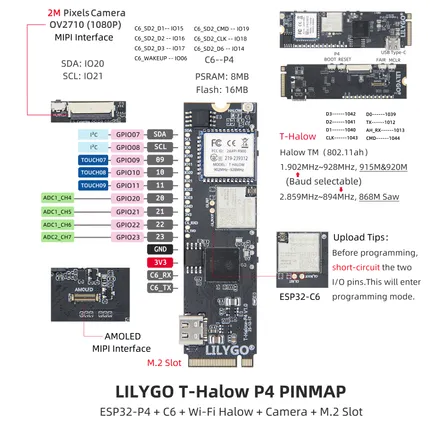

# T-Halow P4

**LILYGO** · ESP32-P4

Revision: Not identified  
Coverage: Pinout image collected

[Browse all manufacturers](../../../../BROWSE.md) · [Devices & IoT](../../../../DEVICES.md) · [Open in the browser guide](https://valleytech-black-wire-guide.pages.dev/?board=lilygo-esp32-t-halow-p4)

Device category: **Controllers & instruments**

## Board pin map

**pinout image** · Reviewed source · JPG

[Open original reference](../../../../library/media/36718b1ebf13b2fb20ec36128eb53b165e84a74e28734fd3dc876b073922c031.jpg)

**Credit and rights:** Not established; source attribution retained. Source/manufacturer: LILYGO.

[Source 1](https://wiki.lilygo.cc/products/t-halow-series/t-halow-p4/index/image/t-halow-p4-pin.jpg) · [Source 2](https://wiki.lilygo.cc/products/t-halow-series/t-halow-p4/)

Manufacturer image preserved. Match the depicted board and revision before use.

Image revision: Not identified

SHA-256: `36718b1ebf13b2fb20ec36128eb53b165e84a74e28734fd3dc876b073922c031`

Pin assignments have not been independently electrically verified. Check board revision before wiring.
