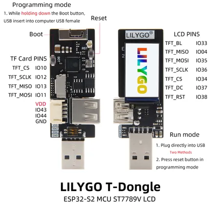

# T-Dongle

**LILYGO** · ESP32-S2

Revision: Not identified

Coverage: Pinout image collected

[Browse all manufacturers](../../../../BROWSE.md) · [Devices & IoT](../../../../DEVICES.md) · [Open in the browser guide](https://valleytech-black-wire-guide.pages.dev/?board=lilygo-esp32-t-dongle)

## Datasheets and original documentation

Board datasheet: **not yet recorded**. Visual reference: **available**.

[Manufacturer source (recorded link)](https://wiki.lilygo.cc/products/t-dongle-series/t-dongle/)

A chip datasheet, schematic and board datasheet have different scopes. Match the exact hardware revision.

[Documentation coverage and remaining gaps](../../../../DOCUMENTATION.md)

## Board pin map

**pinout image** · Reviewed source · JPG

[Open original reference](../../../../library/media/35faf9d27e5d82802565982a5ffa939f54ed8cdd92b25e1e4f791a4b2b8ac92f.jpg)

**Credit and rights:** Not established; source attribution retained. Source/manufacturer: LILYGO.

[Source 1](https://wiki.lilygo.cc/products/t-dongle-series/t-dongle/index/image/t-dongle-pinout.jpg) · [Source 2](https://wiki.lilygo.cc/products/t-dongle-series/t-dongle/)

Manufacturer image preserved. Match the depicted board and revision before use.

Image revision: Not identified

SHA-256: `35faf9d27e5d82802565982a5ffa939f54ed8cdd92b25e1e4f791a4b2b8ac92f`

Pin assignments have not been independently electrically verified. Check board revision before wiring.
