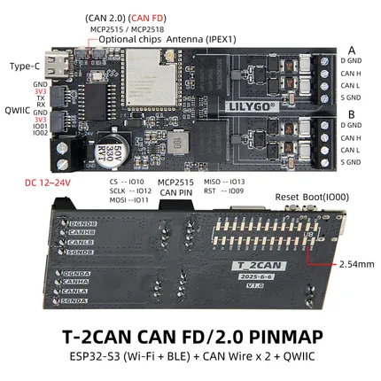

# T-2Can-FD

**LILYGO** · ESP32-S3

Revision: Not identified  
Coverage: Pinout image collected

[Browse all manufacturers](../../../../BROWSE.md) · [Devices & IoT](../../../../DEVICES.md) · [Open in the browser guide](https://valleytech-black-wire-guide.pages.dev/?board=lilygo-esp32-t-2can-fd)

Device category: **Controllers & instruments**

## Board pin map

**pinout image** · Reviewed source · JPG

[Open original reference](../../../../library/media/7b7f32cb917a738cb38f4a4c9dd1dcd1b934c3c41a922a990bf52d37a28b298f.jpg)

**Credit and rights:** Not established; source attribution retained. Source/manufacturer: LILYGO.

[Source 1](https://wiki.lilygo.cc/products/industrial-series/t-2can-fd/index/image/t-2can-fd-pin.jpg) · [Source 2](https://wiki.lilygo.cc/products/industrial-series/t-2can-fd/)

Manufacturer image preserved. Match the depicted board and revision before use.

Image revision: Not identified

SHA-256: `7b7f32cb917a738cb38f4a4c9dd1dcd1b934c3c41a922a990bf52d37a28b298f`

Pin assignments have not been independently electrically verified. Check board revision before wiring.
