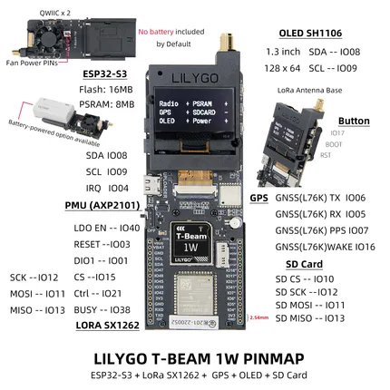
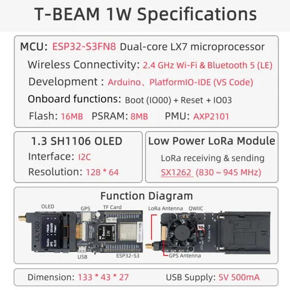

# T-Beam 1W

**LILYGO** · ESP32-S3

Revision: Not identified  
Coverage: Pinout image collected

[Browse all manufacturers](../../../../BROWSE.md) · [Devices & IoT](../../../../DEVICES.md) · [Open in the browser guide](https://valleytech-black-wire-guide.pages.dev/?board=lilygo-esp32-t-beam-1w)

Device category: **Radios & GNSS**

## Board pin map

**pinout image** · Reviewed source · JPG

[Open original reference](../../../../library/media/c6c5cb62d9a3d4c902169cdf49dea78140c9b070d087a7f7f288e737ff72b7ca.jpg)

**Credit and rights:** Not established; source attribution retained. Source/manufacturer: LILYGO.

[Source 1](https://wiki.lilygo.cc/products/t-beam-series/t-beam-1w/index/image/t-beam-1w-pin.jpg) · [Source 2](https://wiki.lilygo.cc/products/t-beam-series/t-beam-1w/)

Manufacturer image preserved. Match the depicted board and revision before use.

Image revision: Not identified

SHA-256: `c6c5cb62d9a3d4c902169cdf49dea78140c9b070d087a7f7f288e737ff72b7ca`

## Device functions and connectors — SX1262 version

**board labeling image** · Reviewed source · JPG

[Open original reference](../../../../library/media/816557f6282f7afea94b9cc1cb5afb0480053752f73e8332071a71c9c7a27b48.jpg)

**Credit and rights:** Not established; source attribution retained. Source/manufacturer: LILYGO.

[Source 1](https://raw.githubusercontent.com/Xinyuan-LilyGO/documentation/f660c0b15d68a7453ba89e52c2325289493ad4a8/public/products/t-beam-series/t-beam-1w/index/image/t-beam-1w-info-en.jpg) · [Source 2](https://wiki.lilygo.cc/products/t-beam-series/t-beam-1w/)

Manufacturer SX1262 model overview with physical connector labels. Not a pinout for the newer LR2021 radio variant.

Image revision: Not identified

SHA-256: `816557f6282f7afea94b9cc1cb5afb0480053752f73e8332071a71c9c7a27b48`

Pin assignments have not been independently electrically verified. Check board revision before wiring.
