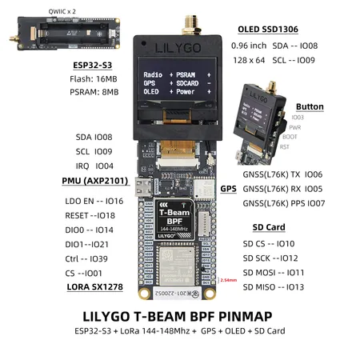

# T-Beam-BPF

**LILYGO** · ESP32-S3

Revision: Not identified  
Coverage: Pinout image collected

[Browse all manufacturers](../../../../BROWSE.md) · [Devices & IoT](../../../../DEVICES.md) · [Open in the browser guide](https://valleytech-black-wire-guide.pages.dev/?board=lilygo-esp32-t-beam-bpf)

Device category: **Radios & GNSS**

## Board pin map

**pinout image** · Reviewed source · JPG

[Open original reference](../../../../library/media/0785fdfced764ed912ae3f9e17dfb157021ac1ca92d27fc7eb3b6ee8c9ea1e96.jpg)

**Credit and rights:** Not established; source attribution retained. Source/manufacturer: LILYGO.

[Source 1](https://wiki.lilygo.cc/products/t-beam-series/t-beam-bpf/index/image/t-beam-bpf-pinout.jpg) · [Source 2](https://wiki.lilygo.cc/products/t-beam-series/t-beam-bpf/)

Manufacturer image preserved. Match the depicted board and revision before use.

Image revision: Not identified

SHA-256: `0785fdfced764ed912ae3f9e17dfb157021ac1ca92d27fc7eb3b6ee8c9ea1e96`

Pin assignments have not been independently electrically verified. Check board revision before wiring.
