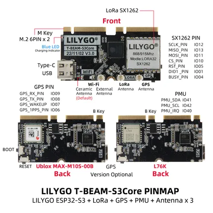

# T-Beam S3 Core

**LILYGO** · ESP32-S3

Revision: Core board with shown radio/GNSS options; internal peripheral assignment map  
Coverage: GPIO reference collected; physical pinout needed

[Browse all manufacturers](../../../../BROWSE.md) · [Desktop app](https://github.com/valleytechsolutions/black-wire-desktop)

## T-BEAM-S3Core

**GPIO reference image** · Reviewed source · JPG

[Open original reference](../../../../library/media/627216ed6a2a5c923c23d3cb4c1d486b9646ab2b1903dadf4ed03ddfbc1b70c0.jpg)

**Credit and rights:** Not established; source attribution retained. Source/manufacturer: LILYGO.

[Source 1](https://raw.githubusercontent.com/Xinyuan-LilyGO/LilyGo-LoRa-Series/5e2da3f519a25e91b9b14c3071e36a568bbd949d/assets/image/T-BEAM-S3Core.jpg) · [Source 2](https://github.com/Xinyuan-LilyGO/LilyGo-LoRa-Series/blob/5e2da3f519a25e91b9b14c3071e36a568bbd949d/assets/image/T-BEAM-S3Core.jpg)

Core board with shown radio/GNSS options; internal peripheral assignment map

SHA-256: `627216ed6a2a5c923c23d3cb4c1d486b9646ab2b1903dadf4ed03ddfbc1b70c0`

Pin assignments have not been independently electrically verified. Check board revision before wiring.
