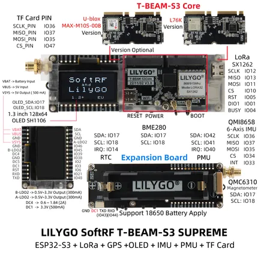
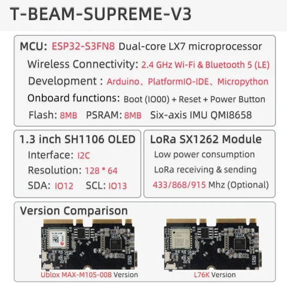

# T-Beam Supreme

**LILYGO** · ESP32-S3

Revision: Multiple source/revision records; see individual assets  
Coverage: Pinout image collected

[Browse all manufacturers](../../../../BROWSE.md) · [Devices & IoT](../../../../DEVICES.md) · [Open in the browser guide](https://valleytech-black-wire-guide.pages.dev/?board=lilygo-esp32-t-beam-supreme)

Device category: **Radios & GNSS**

## Board pin map

**pinout image** · Reviewed source · JPG

[Open original reference](../../../../library/media/0327955191f4a863bbc31da8ced5eb8ce444aabc53302aed09972f9de70dd750.jpg)

**Credit and rights:** Not established; source attribution retained. Source/manufacturer: LILYGO.

[Source 1](https://wiki.lilygo.cc/products/t-beam-series/t-beam-supreme/index/image/t-beam-supreme-pin-en.jpg) · [Source 2](https://wiki.lilygo.cc/products/t-beam-series/t-beam-supreme/)

Manufacturer image preserved. Match the depicted board and revision before use.

Image revision: Not identified

SHA-256: `0327955191f4a863bbc31da8ced5eb8ce444aabc53302aed09972f9de70dd750`

## T-BEAM-S3-Supreme

**pinout image** · Reviewed source · JPG

[Open original reference](../../../../library/media/57ec7a1bb35a2a282310dd4f524001de5981decb8e586f6be048bf75a3596cbe.jpg)

**Credit and rights:** Not established; source attribution retained. Source/manufacturer: LILYGO.

[Source 1](https://raw.githubusercontent.com/Xinyuan-LilyGO/LilyGo-LoRa-Series/5e2da3f519a25e91b9b14c3071e36a568bbd949d/assets/image/T-BEAM-S3-Supreme.jpg) · [Source 2](https://github.com/Xinyuan-LilyGO/LilyGo-LoRa-Series/blob/5e2da3f519a25e91b9b14c3071e36a568bbd949d/assets/image/T-BEAM-S3-Supreme.jpg)

S3 Supreme/core and expansion-board diagram; match the exact radio variant

Image revision: S3 Supreme/core and expansion-board diagram; match the exact radio variant

SHA-256: `57ec7a1bb35a2a282310dd4f524001de5981decb8e586f6be048bf75a3596cbe`

## V3 functions and GNSS version comparison

**board labeling image** · Reviewed source · JPG

[Open original reference](../../../../library/media/019e883dfa69828ab929f78a47c57eb6c046493d834b895007a8b731e7645c8a.jpg)

**Credit and rights:** Not established; source attribution retained. Source/manufacturer: LILYGO.

[Source 1](https://raw.githubusercontent.com/Xinyuan-LilyGO/documentation/f660c0b15d68a7453ba89e52c2325289493ad4a8/public/products/t-beam-series/t-beam-supreme/index/image/t-beam-supreme-info-en.jpg) · [Source 2](https://wiki.lilygo.cc/products/t-beam-series/t-beam-supreme/)

Manufacturer overview explicitly labeled T-BEAM-SUPREME-V3. MAX-M10S and L76K GNSS versions are shown. Not evidence that other revisions share every pin.

Image revision: T-BEAM-SUPREME-V3

SHA-256: `019e883dfa69828ab929f78a47c57eb6c046493d834b895007a8b731e7645c8a`

Pin assignments have not been independently electrically verified. Check board revision before wiring.
