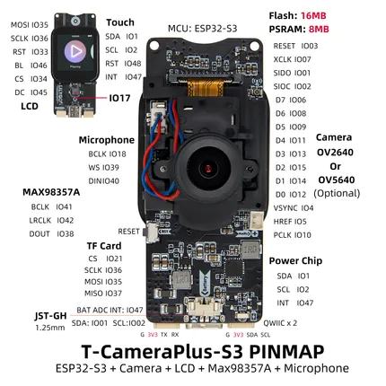

# T-Camera Plus S3

**LILYGO** · ESP32-S3

Revision: Not identified  
Coverage: Pinout image collected

[Browse all manufacturers](../../../../BROWSE.md) · [Desktop app](https://github.com/valleytechsolutions/black-wire-desktop)

## Board pin map

**pinout image** · Reviewed source · JPG

[Open original reference](../../../../library/media/75598eed0b356f07582fc19aab96fad35edcdb9628bbe6cd43de43750133f08f.jpg)

**Credit and rights:** Not established; source attribution retained. Source/manufacturer: LILYGO.

[Source 1](https://wiki.lilygo.cc/products/t-camera-series/t-camera-plus-s3/index/image/t-cameraplus-s3-pin-en.jpg) · [Source 2](https://wiki.lilygo.cc/products/t-camera-series/t-camera-plus-s3/)

Manufacturer image preserved. Match the depicted board and revision before use.

SHA-256: `75598eed0b356f07582fc19aab96fad35edcdb9628bbe6cd43de43750133f08f`

Pin assignments have not been independently electrically verified. Check board revision before wiring.
