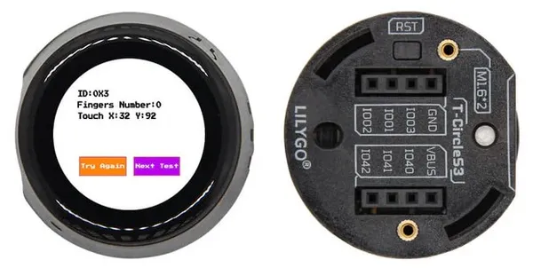
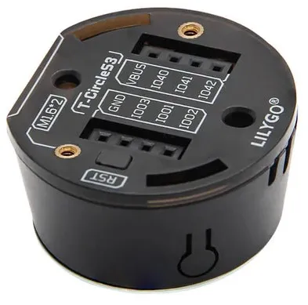

# T-Circle-S3

**LILYGO** · ESP32-S3

Revision: Not identified  
Coverage: Board labels only; pinout needed

[Browse all manufacturers](../../../../BROWSE.md) · [Devices & IoT](../../../../DEVICES.md) · [Open in the browser guide](https://valleytech-black-wire-guide.pages.dev/?board=lilygo-gpio-device-t-circle-s3)

Device category: **Displays & HMI**

## 12

**board labeling image** · Reviewed source · JPG

[Open original reference](../../../../library/media/bea81baa3fc7e3d4fb2d82b1b2d6e97beacbf54875c878594a18d8e85b4bf8aa.jpg)

**Credit and rights:** Not established; source attribution retained. Source/manufacturer: LILYGO.

[Source 1](https://raw.githubusercontent.com/Xinyuan-LilyGO/T-Circle-S3/0a1d29bf6f8a8143a81e07fa36ffda678239ec02/image/12.jpg) · [Source 2](https://github.com/Xinyuan-LilyGO/T-Circle-S3/blob/0a1d29bf6f8a8143a81e07fa36ffda678239ec02/image/12.jpg)

Underside connector silkscreen is visible; a complete annotated pinout is still needed.

Image revision: Not identified

SHA-256: `bea81baa3fc7e3d4fb2d82b1b2d6e97beacbf54875c878594a18d8e85b4bf8aa`

## 14

**board labeling image** · Reviewed source · JPG

[Open original reference](../../../../library/media/67d6b2097e315fb61583fbc7fbbdd9809100f852c5c23b3c5c3c4d3470c393d7.jpg)

**Credit and rights:** Not established; source attribution retained. Source/manufacturer: LILYGO.

[Source 1](https://raw.githubusercontent.com/Xinyuan-LilyGO/T-Circle-S3/0a1d29bf6f8a8143a81e07fa36ffda678239ec02/image/14.jpg) · [Source 2](https://github.com/Xinyuan-LilyGO/T-Circle-S3/blob/0a1d29bf6f8a8143a81e07fa36ffda678239ec02/image/14.jpg)

Underside connector silkscreen is visible; a complete annotated pinout is still needed.

Image revision: Not identified

SHA-256: `67d6b2097e315fb61583fbc7fbbdd9809100f852c5c23b3c5c3c4d3470c393d7`

Pin assignments have not been independently electrically verified. Check board revision before wiring.
