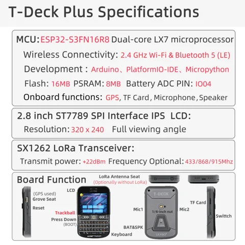

# T-Deck Plus

**LILYGO** · ESP32-S3

Revision: Not identified  
Coverage: Pinout image collected

[Browse all manufacturers](../../../../BROWSE.md) · [Devices & IoT](../../../../DEVICES.md) · [Open in the browser guide](https://valleytech-black-wire-guide.pages.dev/?board=lilygo-gpio-device-t-deck-plus)

Device category: **Handhelds & pocket tools**

## Board pin map

**pinout image** · Reviewed source · JPG

[Open original reference](../../../../library/media/a92a4c2a04825e73f4f77c8a23ae04a1680edab36660629f700eeee78656355b.jpg)

**Credit and rights:** Not established; source attribution retained. Source/manufacturer: LILYGO.

[Source 1](https://wiki.lilygo.cc/products/t-deck-series/t-deck-plus/index/image/t-deck-plus-en.jpg) · [Source 2](https://wiki.lilygo.cc/products/t-deck-series/t-deck-plus/)

Manufacturer image preserved. Match the depicted board and revision before use.

Image revision: Not identified

SHA-256: `a92a4c2a04825e73f4f77c8a23ae04a1680edab36660629f700eeee78656355b`

## Device functions and connector locations

**board labeling image** · Reviewed source · JPG

[Open original reference](../../../../library/media/61ed205e7eaacc57c0171f9f9e2cb8777329a91cc2b8336cf7f4e2c8b951adfb.jpg)

**Credit and rights:** Not established; source attribution retained. Source/manufacturer: LILYGO.

[Source 1](https://raw.githubusercontent.com/Xinyuan-LilyGO/documentation/f660c0b15d68a7453ba89e52c2325289493ad4a8/public/products/t-deck-series/t-deck-plus/index/image/t-deck-info-en.jpg) · [Source 2](https://wiki.lilygo.cc/products/t-deck-series/t-deck-plus/)

Manufacturer T-Deck Plus hardware overview, distinct from the original T-Deck.

Image revision: Not identified

SHA-256: `61ed205e7eaacc57c0171f9f9e2cb8777329a91cc2b8336cf7f4e2c8b951adfb`

Pin assignments have not been independently electrically verified. Check board revision before wiring.
