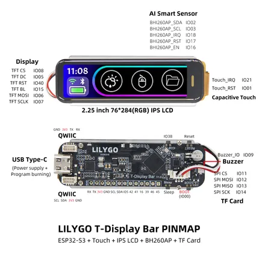

# T-Display Bar

**LILYGO** · ESP32-S3

Revision: Not identified  
Coverage: Pinout image collected

[Browse all manufacturers](../../../../BROWSE.md) · [Desktop app](https://github.com/valleytechsolutions/black-wire-desktop)

## Board pin map

**pinout image** · Reviewed source · JPG

[Open original reference](../../../../library/media/c396cb512b4a786b250c27c29238a9b58714dcd6fc0f9a45b53b8f8e35c90f88.jpg)

**Credit and rights:** Not established; source attribution retained. Source/manufacturer: LILYGO.

[Source 1](https://wiki.lilygo.cc/products/t-display-series/t-display-bar/index/image/t-display-bar-pin.jpg) · [Source 2](https://wiki.lilygo.cc/products/t-display-series/t-display-bar/)

Manufacturer image preserved. Match the depicted board and revision before use.

SHA-256: `c396cb512b4a786b250c27c29238a9b58714dcd6fc0f9a45b53b8f8e35c90f88`

Pin assignments have not been independently electrically verified. Check board revision before wiring.
