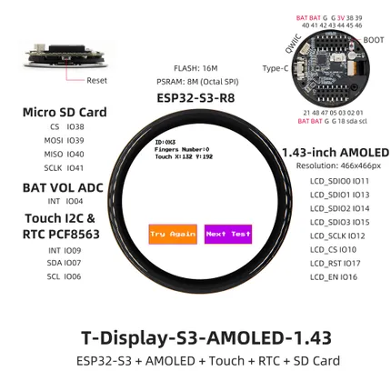

# T-Display S3 AMOLED 1.43

**LILYGO** · ESP32-S3

Revision: Not identified  
Coverage: Pinout image collected

[Browse all manufacturers](../../../../BROWSE.md) · [Desktop app](https://github.com/valleytechsolutions/black-wire-desktop)

## Board pin map

**pinout image** · Reviewed source · JPG

[Open original reference](../../../../library/media/ede4c6cf0a54c3595941a26c06fe7fbb7d9bf40ddf749317408cb9eb947f4184.jpg)

**Credit and rights:** Not established; source attribution retained. Source/manufacturer: LILYGO.

[Source 1](https://wiki.lilygo.cc/products/t-display-series/t-display-s3-amoled-1.43/index/image/t-display-s3-amoled-1.43-en.jpg) · [Source 2](https://wiki.lilygo.cc/products/t-display-series/t-display-s3-amoled-1.43/)

Manufacturer image preserved. Match the depicted board and revision before use.

SHA-256: `ede4c6cf0a54c3595941a26c06fe7fbb7d9bf40ddf749317408cb9eb947f4184`

Pin assignments have not been independently electrically verified. Check board revision before wiring.
