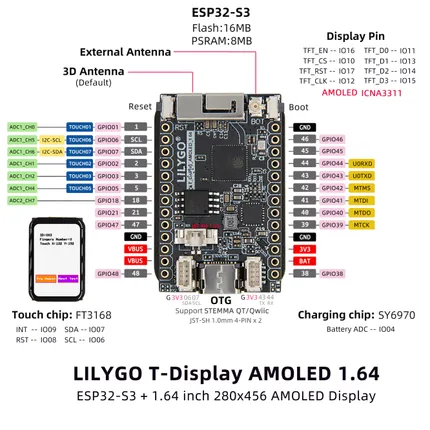

# T-Display S3 AMOLED 1.64

**LILYGO** · ESP32-S3

Revision: Not identified  
Coverage: Pinout image collected

[Browse all manufacturers](../../../../BROWSE.md) · [Desktop app](https://github.com/valleytechsolutions/black-wire-desktop)

## Board pin map

**pinout image** · Reviewed source · JPG

[Open original reference](../../../../library/media/de2d0800ee69ed424a1d71bf78ba52931ed84476ef61a4e28c242e107b087899.jpg)

**Credit and rights:** Not established; source attribution retained. Source/manufacturer: LILYGO.

[Source 1](https://wiki.lilygo.cc/products/t-display-series/t-display-s3-amoled-1.64/index/image/t-display-s3-amoled-1.64-en.jpg) · [Source 2](https://wiki.lilygo.cc/products/t-display-series/t-display-s3-amoled-1.64/)

Manufacturer image preserved. Match the depicted board and revision before use.

SHA-256: `de2d0800ee69ed424a1d71bf78ba52931ed84476ef61a4e28c242e107b087899`

Pin assignments have not been independently electrically verified. Check board revision before wiring.
