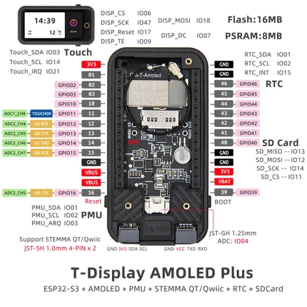

# T-Display S3 AMOLED Plus

**LILYGO** · ESP32-S3

Revision: Not identified  
Coverage: Pinout image collected

[Browse all manufacturers](../../../../BROWSE.md) · [Devices & IoT](../../../../DEVICES.md) · [Open in the browser guide](https://valleytech-black-wire-guide.pages.dev/?board=lilygo-esp32-t-display-s3-amoled-plus)

Device category: **Displays & HMI**

## Board pin map

**pinout image** · Reviewed source · JPG

[Open original reference](../../../../library/media/d8c809a32b275b902317cfa58a28bd1c8d080dd73c178756ccb7f1cd8005d6c5.jpg)

**Credit and rights:** Not established; source attribution retained. Source/manufacturer: LILYGO.

[Source 1](https://wiki.lilygo.cc/products/t-display-series/t-display-s3-amoled-plus/index/image/t-display-s3-amoled-plus-3.jpg) · [Source 2](https://wiki.lilygo.cc/products/t-display-series/t-display-s3-amoled-plus/)

Manufacturer image preserved. Match the depicted board and revision before use.

Image revision: Not identified

SHA-256: `d8c809a32b275b902317cfa58a28bd1c8d080dd73c178756ccb7f1cd8005d6c5`

Pin assignments have not been independently electrically verified. Check board revision before wiring.
