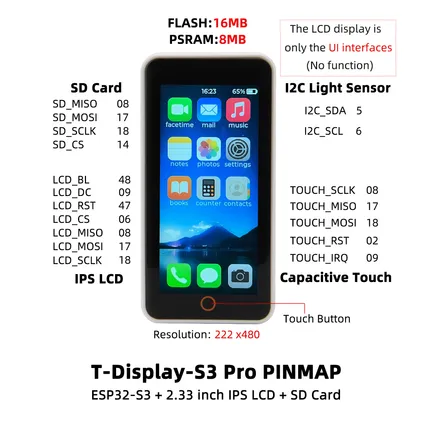
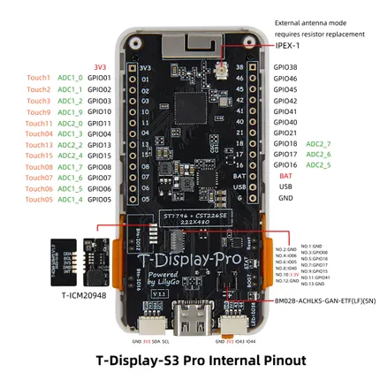

# T-Display S3 Pro

**LILYGO** · ESP32-S3

Revision: Not identified  
Coverage: Pinout image collected

[Browse all manufacturers](../../../../BROWSE.md) · [Devices & IoT](../../../../DEVICES.md) · [Open in the browser guide](https://valleytech-black-wire-guide.pages.dev/?board=lilygo-esp32-t-display-s3-pro)

Device category: **Displays & HMI**

## Board pin map

**pinout image** · Reviewed source · JPG

[Open original reference](../../../../library/media/2d4da75160992fd0a7072416b935ab9d434268fb916a01a0c175ef23a8b44124.jpg)

**Credit and rights:** Not established; source attribution retained. Source/manufacturer: LILYGO.

[Source 1](https://wiki.lilygo.cc/products/t-display-series/t-display-s3-pro/index/image/t-display-s3 pro-pin.jpg) · [Source 2](https://wiki.lilygo.cc/products/t-display-series/t-display-s3-pro/)

Manufacturer image preserved. Match the depicted board and revision before use.

Image revision: Not identified

SHA-256: `2d4da75160992fd0a7072416b935ab9d434268fb916a01a0c175ef23a8b44124`

## Board pin map

**pinout image** · Reviewed source · JPG

[Open original reference](../../../../library/media/b7b7b80e35d3f05ca7b0d11fdfd34a45a88575c2f45f8dbfbdf8d4666a07b534.jpg)

**Credit and rights:** Not established; source attribution retained. Source/manufacturer: LILYGO.

[Source 1](https://wiki.lilygo.cc/products/t-display-series/t-display-s3-pro/index/image/t-display-pro-pin-behind.jpg) · [Source 2](https://wiki.lilygo.cc/products/t-display-series/t-display-s3-pro/)

Manufacturer image preserved. Match the depicted board and revision before use.

Image revision: Not identified

SHA-256: `b7b7b80e35d3f05ca7b0d11fdfd34a45a88575c2f45f8dbfbdf8d4666a07b534`

Pin assignments have not been independently electrically verified. Check board revision before wiring.
