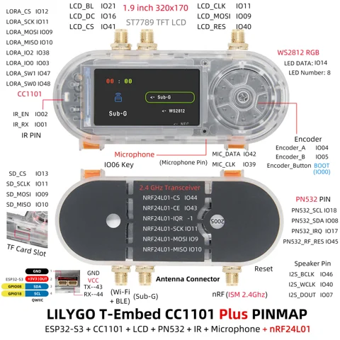
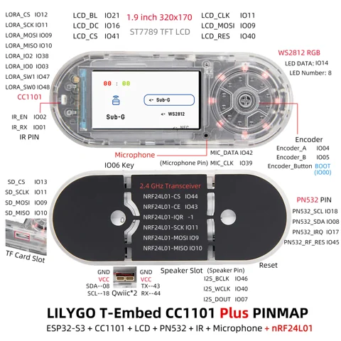

# T-Embed CC1101 Plus

**LILYGO** · ESP32-S3

Revision: K268 internal / K268-01 external antenna; select the matching sheet  
Coverage: Pinout image collected

[Browse all manufacturers](../../../../BROWSE.md) · [Devices & IoT](../../../../DEVICES.md) · [Open in the browser guide](https://valleytech-black-wire-guide.pages.dev/?board=lilygo-gpio-device-t-embed-cc1101-plus)

Device category: **Handhelds & pocket tools**

## K268-01 external-antenna Plus pin map

**pinout image** · Reviewed source · JPG

[Open original reference](../../../../library/media/b6edaebd0b509849745111af8398c4b77db77dc5594b618f4e5fbdfd24822f60.jpg)

**Credit and rights:** Not established; source attribution retained. Source/manufacturer: LILYGO.

[Source 1](https://cdn.shopify.com/s/files/1/0617/7190/7253/files/LILYGO-EMBED.jpg?v=1781660166) · [Source 2](https://lilygo.cc/products/t-embed-cc1101-plus)

Exact Plus device pin map with nRF24L01, NFC, Qwiic, speaker, UART and radio assignments. External antenna version pictured; source documentation identifies K268-01.

Image revision: K268-01 external antenna version

SHA-256: `b6edaebd0b509849745111af8398c4b77db77dc5594b618f4e5fbdfd24822f60`

## K268 internal-antenna Plus pin map

**pinout image** · Reviewed source · JPG

[Open original reference](../../../../library/media/d1adcdb0cbd4b5b2a9f4b58de1162be271e961015bc618acb49199845ca21dba.jpg)

**Credit and rights:** Not established; source attribution retained. Source/manufacturer: LILYGO.

[Source 1](https://cdn.shopify.com/s/files/1/0617/7190/7253/files/T-Embed-cc1101-plus.jpg?v=1754635748) · [Source 2](https://lilygo.cc/products/t-embed-cc1101-plus)

Exact Plus device pin map with nRF24L01. Internal antenna version pictured; source documentation identifies K268. Do not confuse this with the base T-Embed CC1101.

Image revision: K268 internal antenna version

SHA-256: `d1adcdb0cbd4b5b2a9f4b58de1162be271e961015bc618acb49199845ca21dba`

Pin assignments have not been independently electrically verified. Check board revision before wiring.
