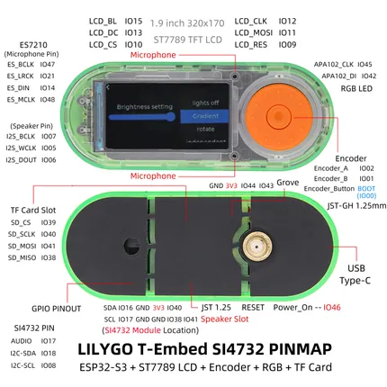

# T-Embed SI4732

**LILYGO** · ESP32-S3

Revision: Not identified  
Coverage: Pinout image collected

[Browse all manufacturers](../../../../BROWSE.md) · [Devices & IoT](../../../../DEVICES.md) · [Open in the browser guide](https://valleytech-black-wire-guide.pages.dev/?board=lilygo-esp32-t-embed-si4732)

Device category: **Handhelds & pocket tools**

## Board pin map

**pinout image** · Reviewed source · JPG

[Open original reference](../../../../library/media/c49cfdc5c0f59cf2d0872dcb10ab5377e796fc3ced3f03743e34ac38bbeba79b.jpg)

**Credit and rights:** Not established; source attribution retained. Source/manufacturer: LILYGO.

[Source 1](https://wiki.lilygo.cc/products/t-embed-series/t-embed-si4732/index/image/t-embed-si4732.jpg) · [Source 2](https://wiki.lilygo.cc/products/t-embed-series/t-embed-si4732/)

Manufacturer image preserved. Match the depicted board and revision before use.

Image revision: Not identified

SHA-256: `c49cfdc5c0f59cf2d0872dcb10ab5377e796fc3ced3f03743e34ac38bbeba79b`

Pin assignments have not been independently electrically verified. Check board revision before wiring.
