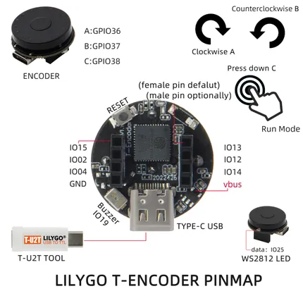

# T-Encoder

**LILYGO** · ESP32-S3

Revision: Not identified  
Coverage: Pinout image collected

[Browse all manufacturers](../../../../BROWSE.md) · [Desktop app](https://github.com/valleytechsolutions/black-wire-desktop)

## Board pin map

**pinout image** · Reviewed source · JPG

[Open original reference](../../../../library/media/0e6439379379c54d363b7d482b3dd23742e61a23a4e5f5d20f75cc8c06035542.jpg)

**Credit and rights:** Not established; source attribution retained. Source/manufacturer: LILYGO.

[Source 1](https://wiki.lilygo.cc/products/t-encoder-series/t-encoder/index/image/t-encoder-pinout.jpg) · [Source 2](https://wiki.lilygo.cc/products/t-encoder-series/t-encoder/)

Manufacturer image preserved. Match the depicted board and revision before use.

SHA-256: `0e6439379379c54d363b7d482b3dd23742e61a23a4e5f5d20f75cc8c06035542`

Pin assignments have not been independently electrically verified. Check board revision before wiring.
