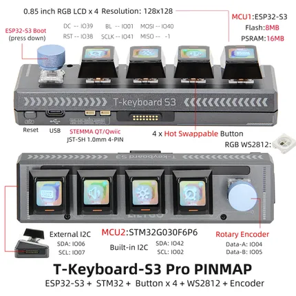

# T-Keyboard S3 Pro

**LILYGO** · ESP32-S3

Revision: Not identified  
Coverage: Pinout image collected

[Browse all manufacturers](../../../../BROWSE.md) · [Desktop app](https://github.com/valleytechsolutions/black-wire-desktop)

## Board pin map

**pinout image** · Reviewed source · JPG

[Open original reference](../../../../library/media/16205d4456d8a7c62d956b3b61e77cc14a8c4bdc485da54ad9ea2df28108787f.jpg)

**Credit and rights:** Not established; source attribution retained. Source/manufacturer: LILYGO.

[Source 1](https://wiki.lilygo.cc/products/other/t-keyboard-s3-pro/index/image/t-keyboard-s3-pro-en.jpg) · [Source 2](https://wiki.lilygo.cc/products/other/t-keyboard-s3-pro/)

Manufacturer image preserved. Match the depicted board and revision before use.

SHA-256: `16205d4456d8a7c62d956b3b61e77cc14a8c4bdc485da54ad9ea2df28108787f`

Pin assignments have not been independently electrically verified. Check board revision before wiring.
