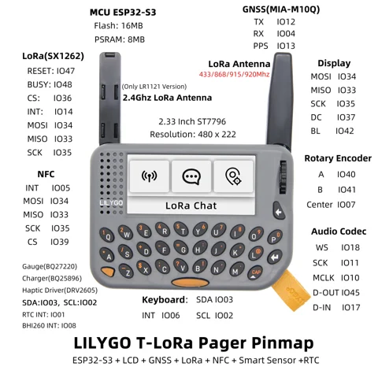

# T-LoRa Pager

**LILYGO** · ESP32-S3

Revision: Not identified  
Coverage: Pinout image collected

[Browse all manufacturers](../../../../BROWSE.md) · [Devices & IoT](../../../../DEVICES.md) · [Open in the browser guide](https://valleytech-black-wire-guide.pages.dev/?board=lilygo-gpio-device-t-lora-pager)

Device category: **Radios & GNSS**

## Device pin map — radio, display, NFC, audio and GNSS

**pinout image** · Reviewed source · JPG

[Open original reference](../../../../library/media/f9297136fff4c411ec80bf55edf326f97bfd7268e242caf71600174c5b83d899.jpg)

**Credit and rights:** Not established; source attribution retained. Source/manufacturer: LILYGO.

[Source 1](https://raw.githubusercontent.com/Xinyuan-LilyGO/documentation/f660c0b15d68a7453ba89e52c2325289493ad4a8/public/products/t-lora-series/t-lora-pager/index/image/t-lorapager-3.jpg) · [Source 2](https://wiki.lilygo.cc/products/t-lora-series/t-lora-pager/)

Manufacturer device pin map. Radio options differ. The wiki language variants disagree on some interrupt assignments; match the exact hardware and current schematic before wiring. This picture does not show all expansion-header positions.

Image revision: Not identified

SHA-256: `f9297136fff4c411ec80bf55edf326f97bfd7268e242caf71600174c5b83d899`

Pin assignments have not been independently electrically verified. Check board revision before wiring.
