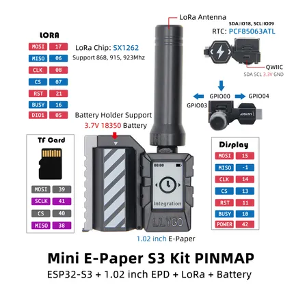

# T-Mini E-Paper S3

**LILYGO** · ESP32-S3

Revision: Not identified  
Coverage: Pinout image collected

[Browse all manufacturers](../../../../BROWSE.md) · [Desktop app](https://github.com/valleytechsolutions/black-wire-desktop)

## Board pin map

**pinout image** · Reviewed source · JPG

[Open original reference](../../../../library/media/3e8d1fabecba6314b64878b091c7b7bf2daea3e959e23c6eebd269a2d8e77013.jpg)

**Credit and rights:** Not established; source attribution retained. Source/manufacturer: LILYGO.

[Source 1](https://wiki.lilygo.cc/products/other/t-mini-e-paper-s3/index/image/t-mini-e-paper-s3-pin.jpg) · [Source 2](https://wiki.lilygo.cc/products/other/t-mini-e-paper-s3/)

Manufacturer image preserved. Match the depicted board and revision before use.

SHA-256: `3e8d1fabecba6314b64878b091c7b7bf2daea3e959e23c6eebd269a2d8e77013`

Pin assignments have not been independently electrically verified. Check board revision before wiring.
