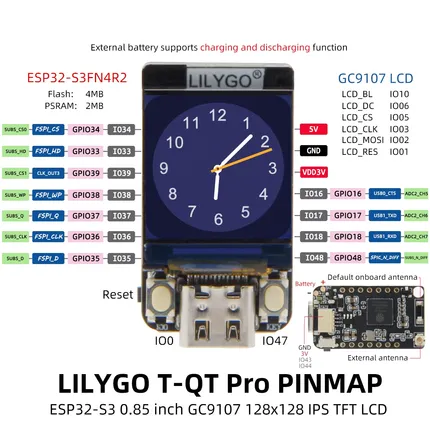

# T-QT Pro (N4R2)

**LILYGO** · ESP32-S3

Revision: Not identified  
Coverage: Pinout image collected

[Browse all manufacturers](../../../../BROWSE.md) · [Desktop app](https://github.com/valleytechsolutions/black-wire-desktop)

## pinmap_en

**pinout image** · Reviewed source · JPG

[Open original reference](../../../../library/media/4f6a2b8e2392c5a7cf449f1e1390dc5cab40017b3de671dfb4c7777f2e63dd40.jpg)

**Credit and rights:** Not established; source attribution retained. Source/manufacturer: LILYGO.

[Source 1](https://raw.githubusercontent.com/Xinyuan-LilyGO/T-QT/230f0c0ea7677fdde29ca7a49a419dbf597e6b3e/image/pinmap_en.jpg) · [Source 2](https://github.com/Xinyuan-LilyGO/T-QT/blob/230f0c0ea7677fdde29ca7a49a419dbf597e6b3e/image/pinmap_en.jpg)

The depicted processor is ESP32-S3FH4R2. Do not infer coverage of the separate N8 variant.

SHA-256: `4f6a2b8e2392c5a7cf449f1e1390dc5cab40017b3de671dfb4c7777f2e63dd40`

Pin assignments have not been independently electrically verified. Check board revision before wiring.
