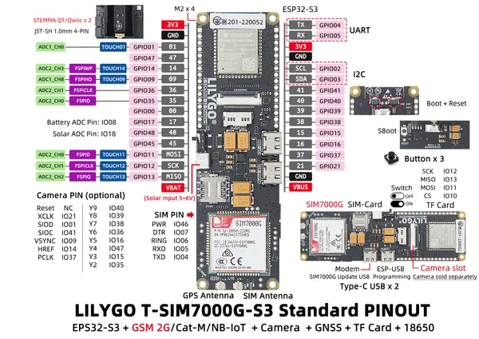

# T-SIM7000G-S3 Standard

**LILYGO** · ESP32-S3

Revision: Not identified  
Coverage: Pinout image collected

[Browse all manufacturers](../../../../BROWSE.md) · [Devices & IoT](../../../../DEVICES.md) · [Open in the browser guide](https://valleytech-black-wire-guide.pages.dev/?board=lilygo-esp32-t-sim7000g-s3-standard)

Device category: **Controllers & instruments**

## Board pin map

**pinout image** · Reviewed source · JPG

[Open original reference](../../../../library/media/3d5631e7db8bc32518210fd874e60f617bf756ce9a232fd0c2ad23d16ef6e2e0.jpg)

**Credit and rights:** Not established; source attribution retained. Source/manufacturer: LILYGO.

[Source 1](https://wiki.lilygo.cc/products/t-sim-series/t-sim7000/index/image/t-sim7000-pinout.jpg) · [Source 2](https://wiki.lilygo.cc/products/t-sim-series/t-sim7000/)

Manufacturer image preserved. Match the depicted board and revision before use. Source page name: T-SIM7000G. Saved model name follows the printed diagram.

Image revision: Not identified

SHA-256: `3d5631e7db8bc32518210fd874e60f617bf756ce9a232fd0c2ad23d16ef6e2e0`

Pin assignments have not been independently electrically verified. Check board revision before wiring.
