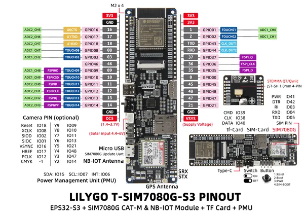

# T-SIM7080X-S3

**LILYGO** · ESP32-S3

Revision: Not identified  
Coverage: Pinout image collected

[Browse all manufacturers](../../../../BROWSE.md) · [Desktop app](https://github.com/valleytechsolutions/black-wire-desktop)

## Board pin map

**pinout image** · Reviewed source · JPG

[Open original reference](../../../../library/media/6abc3ebf8aefd1bd0dcea3c6da85c7d3f1299e103906c05e8ccbb72a1ec2bf54.jpg)

**Credit and rights:** Not established; source attribution retained. Source/manufacturer: LILYGO.

[Source 1](https://wiki.lilygo.cc/products/t-sim-series/t-sim7080x-s3/index/image/t-sim7080x-s3-pinout.jpg) · [Source 2](https://wiki.lilygo.cc/products/t-sim-series/t-sim7080x-s3/)

Manufacturer image preserved. Match the depicted board and revision before use.

SHA-256: `6abc3ebf8aefd1bd0dcea3c6da85c7d3f1299e103906c05e8ccbb72a1ec2bf54`

Pin assignments have not been independently electrically verified. Check board revision before wiring.
