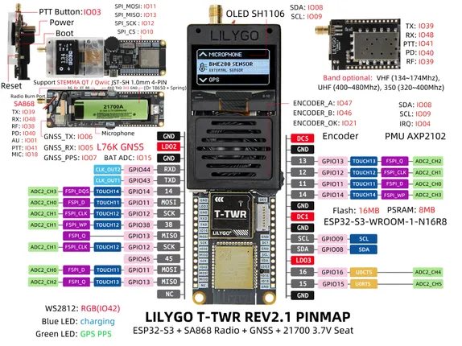

# T-TWR

**LILYGO** · ESP32-S3

Revision: Not identified  
Coverage: Pinout image collected

[Browse all manufacturers](../../../../BROWSE.md) · [Desktop app](https://github.com/valleytechsolutions/black-wire-desktop)

## Board pin map

**pinout image** · Reviewed source · JPG

[Open original reference](../../../../library/media/78374b0ddebcaa50477aa818b1e28e665144309a9ac48b6d797e4f862b83cae2.jpg)

**Credit and rights:** Not established; source attribution retained. Source/manufacturer: LILYGO.

[Source 1](https://wiki.lilygo.cc/products/t-twr-series/t-twr/index/image/t-twr-3.jpg) · [Source 2](https://wiki.lilygo.cc/products/t-twr-series/t-twr/)

Manufacturer image preserved. Match the depicted board and revision before use.

SHA-256: `78374b0ddebcaa50477aa818b1e28e665144309a9ac48b6d797e4f862b83cae2`

Pin assignments have not been independently electrically verified. Check board revision before wiring.
