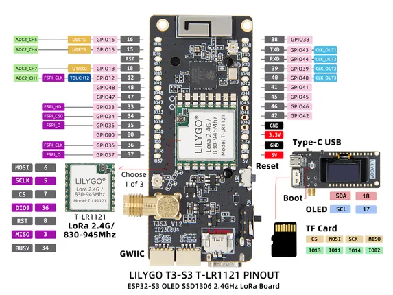

# T3-S3 LR1121

**LILYGO** · ESP32-S3

Revision: Not identified  
Coverage: Pinout image collected

[Browse all manufacturers](../../../../BROWSE.md) · [Desktop app](https://github.com/valleytechsolutions/black-wire-desktop)

## Board pin map

**pinout image** · Reviewed source · JPG

[Open original reference](../../../../library/media/34112b2f87cdca4bebc29deadc5bb6fb5426bfab051714b8a67649183c6f28de.jpg)

**Credit and rights:** Not established; source attribution retained. Source/manufacturer: LILYGO.

[Source 1](https://wiki.lilygo.cc/products/t3-series/t3-s3-lr1121/index/image/t3-s3-lr1121-3.jpg) · [Source 2](https://wiki.lilygo.cc/products/t3-series/t3-s3-lr1121/)

Manufacturer image preserved. Match the depicted board and revision before use.

SHA-256: `34112b2f87cdca4bebc29deadc5bb6fb5426bfab051714b8a67649183c6f28de`

Pin assignments have not been independently electrically verified. Check board revision before wiring.
