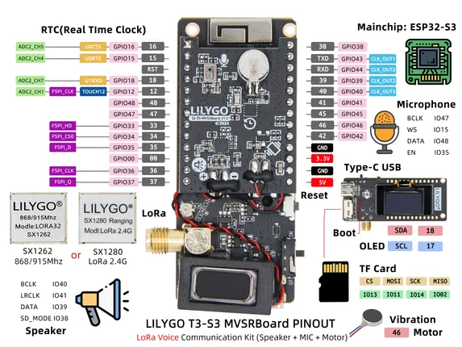

# T3-S3 MVSR Board

**LILYGO** · ESP32-S3

Revision: Not identified  
Coverage: Pinout image collected

[Browse all manufacturers](../../../../BROWSE.md) · [Devices & IoT](../../../../DEVICES.md) · [Open in the browser guide](https://valleytech-black-wire-guide.pages.dev/?board=lilygo-esp32-t3-s3-mvsr-board)

Device category: **Controllers & instruments**

## Board pin map

**pinout image** · Reviewed source · JPG

[Open original reference](../../../../library/media/739670a771101d835533c93bcefc8d84ddebaa92c0eabebeb1e08a225364f9d3.jpg)

**Credit and rights:** Not established; source attribution retained. Source/manufacturer: LILYGO.

[Source 1](https://wiki.lilygo.cc/products/t3-series/t3-s3-mvsr/index/image/t3-s3_mvsrboard.jpg) · [Source 2](https://wiki.lilygo.cc/products/t3-series/t3-s3-mvsr/)

Manufacturer image preserved. Match the depicted board and revision before use.

Image revision: Not identified

SHA-256: `739670a771101d835533c93bcefc8d84ddebaa92c0eabebeb1e08a225364f9d3`

Pin assignments have not been independently electrically verified. Check board revision before wiring.
