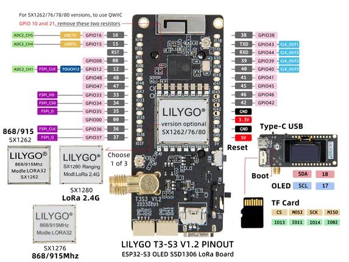

# T3-S3 V1.2

**LILYGO** · ESP32-S3

Revision: Not identified  
Coverage: Pinout image collected

[Browse all manufacturers](../../../../BROWSE.md) · [Desktop app](https://github.com/valleytechsolutions/black-wire-desktop)

## Board pin map

**pinout image** · Reviewed source · JPG

[Open original reference](../../../../library/media/3baf0077e6ce92db11819ade8e1d9cf85b5d9ad1418ed8eb6c4e71b9a9b81beb.jpg)

**Credit and rights:** Not established; source attribution retained. Source/manufacturer: LILYGO.

[Source 1](https://wiki.lilygo.cc/products/t3-series/t3-s3/index/image/t3s3-pin.jpg) · [Source 2](https://wiki.lilygo.cc/products/t3-series/t3-s3/)

Manufacturer image preserved. Match the depicted board and revision before use. Source page name: T3-S3. Saved model name follows the printed diagram.

SHA-256: `3baf0077e6ce92db11819ade8e1d9cf85b5d9ad1418ed8eb6c4e71b9a9b81beb`

Pin assignments have not been independently electrically verified. Check board revision before wiring.
