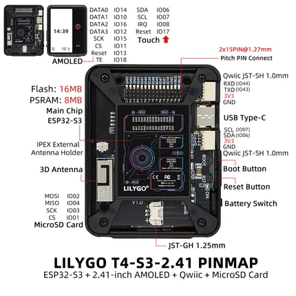

# T4-S3-2.41

**LILYGO** · ESP32-S3

Revision: Not identified  
Coverage: Pinout image collected

[Browse all manufacturers](../../../../BROWSE.md) · [Desktop app](https://github.com/valleytechsolutions/black-wire-desktop)

## Board pin map

**pinout image** · Reviewed source · JPG

[Open original reference](../../../../library/media/a0d55badfdb7418e7ea54dd0371bcc25ef8449c65465ab9b27ff01acf58961ae.jpg)

**Credit and rights:** Not established; source attribution retained. Source/manufacturer: LILYGO.

[Source 1](https://wiki.lilygo.cc/products/t4-series/t4-s3/index/image/t4-s3-pinout.jpg) · [Source 2](https://wiki.lilygo.cc/products/t4-series/t4-s3/)

Manufacturer image preserved. Match the depicted board and revision before use. Source page name: T4-S3. Saved model name follows the printed diagram.

SHA-256: `a0d55badfdb7418e7ea54dd0371bcc25ef8449c65465ab9b27ff01acf58961ae`

Pin assignments have not been independently electrically verified. Check board revision before wiring.
