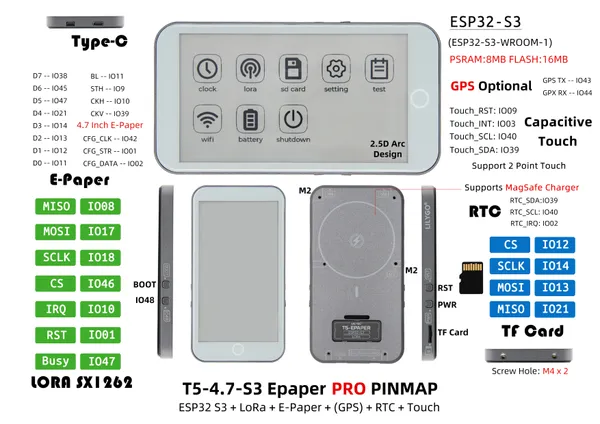

# T5-4.7 E-Paper S3 Pro

**LILYGO** · ESP32-S3

Revision: Not identified  
Coverage: Pinout image collected

[Browse all manufacturers](../../../../BROWSE.md) · [Devices & IoT](../../../../DEVICES.md) · [Open in the browser guide](https://valleytech-black-wire-guide.pages.dev/?board=lilygo-esp32-t5-4-7-e-paper-s3-pro)

Device category: **Displays & HMI**

## Board pin map

**pinout image** · Reviewed source · JPG

[Open original reference](../../../../library/media/d639bddcdd9e63db9bab5e5af7710c038bd966b5ad04eddd5a838747f1489c55.jpg)

**Credit and rights:** Not established; source attribution retained. Source/manufacturer: LILYGO.

[Source 1](https://wiki.lilygo.cc/products/t5-series/t5-e-paper-s3-pro/index/image/t5-e-paper-s3-pro-en.jpg) · [Source 2](https://wiki.lilygo.cc/products/t5-series/t5-e-paper-s3-pro/)

Manufacturer image preserved. Match the depicted board and revision before use.

Image revision: Not identified

SHA-256: `d639bddcdd9e63db9bab5e5af7710c038bd966b5ad04eddd5a838747f1489c55`

Pin assignments have not been independently electrically verified. Check board revision before wiring.
