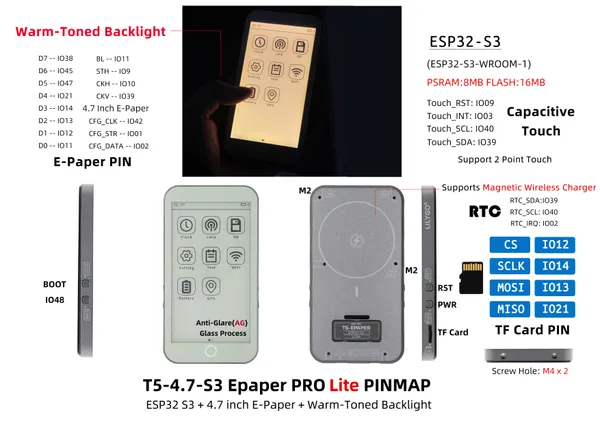

# T5-4.7-S3 E-Paper Pro Lite

**LILYGO** · ESP32-S3

Revision: Not identified  
Coverage: Pinout image collected

[Browse all manufacturers](../../../../BROWSE.md) · [Desktop app](https://github.com/valleytechsolutions/black-wire-desktop)

## Board pin map

**pinout image** · Reviewed source · JPG

[Open original reference](../../../../library/media/7cc04ae160f8c575d76baeaa2576b087e22619d1ac49f787f34dc4677de5c846.jpg)

**Credit and rights:** Not established; source attribution retained. Source/manufacturer: LILYGO.

[Source 1](https://wiki.lilygo.cc/products/t5-series/t5-e-paper-s3-lite/index/image/t5-4.7-s3-pro-pin.jpg) · [Source 2](https://wiki.lilygo.cc/products/t5-series/t5-e-paper-s3-lite/)

Manufacturer image preserved. Match the depicted board and revision before use. Source page name: T5-4.7 E-Paper S3 Lite. Saved model name follows the printed diagram.

SHA-256: `7cc04ae160f8c575d76baeaa2576b087e22619d1ac49f787f34dc4677de5c846`

Pin assignments have not been independently electrically verified. Check board revision before wiring.
