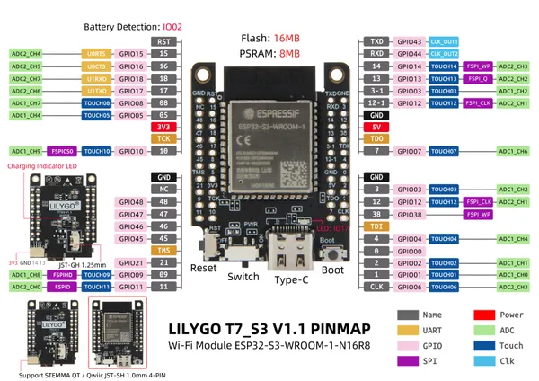

# T7-S3

**LILYGO** · ESP32-S3

Revision: Multiple source/revision records; see individual assets  
Coverage: Pinout image collected

[Browse all manufacturers](../../../../BROWSE.md) · [Desktop app](https://github.com/valleytechsolutions/black-wire-desktop)

## Board pin map

**pinout image** · Reviewed source · JPG

[Open original reference](../../../../library/media/6a7b62160c6b18ac275a4c2946cbd2af2711bb6f265f4b9954585a9b37ebab51.jpg)

**Credit and rights:** Not established; source attribution retained. Source/manufacturer: LILYGO.

[Source 1](https://wiki.lilygo.cc/products/t7-series/t7-s3/index/image/t7-s3-pinout.jpg) · [Source 2](https://wiki.lilygo.cc/products/t7-series/t7-s3/)

Manufacturer image preserved. Match the depicted board and revision before use.

SHA-256: `6a7b62160c6b18ac275a4c2946cbd2af2711bb6f265f4b9954585a9b37ebab51`

## t7-s3_v1.1_pinmap

**pinout image** · Reviewed source · JPG

[Open original reference](../../../../library/media/c6b101918b9aad3fc5023daffcc83c13207752eaedfe3ad36beb48e5876dd684.jpg)

**Credit and rights:** Not established; source attribution retained. Source/manufacturer: LILYGO.

[Source 1](https://raw.githubusercontent.com/Xinyuan-LilyGO/T7-S3/6da73f50a73dcb9cc86283cce1bf64d1c0d03620/assets/image/t7-s3_v1.1_pinmap.jpg) · [Source 2](https://github.com/Xinyuan-LilyGO/T7-S3/blob/6da73f50a73dcb9cc86283cce1bf64d1c0d03620/assets/image/t7-s3_v1.1_pinmap.jpg)

V1.1 shown

SHA-256: `c6b101918b9aad3fc5023daffcc83c13207752eaedfe3ad36beb48e5876dd684`

Pin assignments have not been independently electrically verified. Check board revision before wiring.
