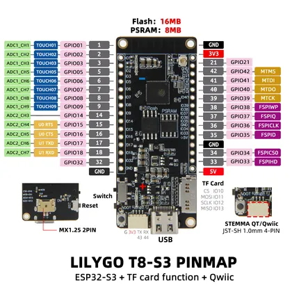

# T8-S3

**LILYGO** · ESP32-S3

Revision: Not identified  
Coverage: Pinout image collected

[Browse all manufacturers](../../../../BROWSE.md) · [Desktop app](https://github.com/valleytechsolutions/black-wire-desktop)

## Board pin map

**pinout image** · Reviewed source · JPG

[Open original reference](../../../../library/media/25894c85f16149d070cb1dba94d0c65e99431e8fd59b820334d047a0b109daf3.jpg)

**Credit and rights:** Not established; source attribution retained. Source/manufacturer: LILYGO.

[Source 1](https://wiki.lilygo.cc/products/t8-series/t8/index/image/t8-pinout.jpg) · [Source 2](https://wiki.lilygo.cc/zh/products/t8-series/t8/)

Manufacturer image preserved. Match the depicted board and revision before use. Source page name: T8. Saved model name follows the printed diagram.

SHA-256: `25894c85f16149d070cb1dba94d0c65e99431e8fd59b820334d047a0b109daf3`

Pin assignments have not been independently electrically verified. Check board revision before wiring.
