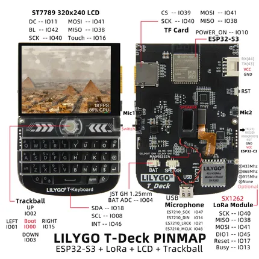

# T-Deck

**LILYGO** · ESP32

Revision: Not identified  
Coverage: Pinout image collected

[Browse all manufacturers](../../../../BROWSE.md) · [Desktop app](https://github.com/valleytechsolutions/black-wire-desktop)

## Board pin map

**pinout image** · Reviewed source · JPG

[Open original reference](../../../../library/media/de4ea53827a367c9e2f0db690ded9dd24d08110c868f20f0245c9259f004523f.jpg)

**Credit and rights:** Not established; source attribution retained. Source/manufacturer: LILYGO.

[Source 1](https://wiki.lilygo.cc/products/t-deck-series/t-deck/index/image/t-deck-pin-en.jpg) · [Source 2](https://wiki.lilygo.cc/products/t-deck-series/t-deck/)

Manufacturer image preserved. Match the depicted board and revision before use.

SHA-256: `de4ea53827a367c9e2f0db690ded9dd24d08110c868f20f0245c9259f004523f`

Pin assignments have not been independently electrically verified. Check board revision before wiring.
