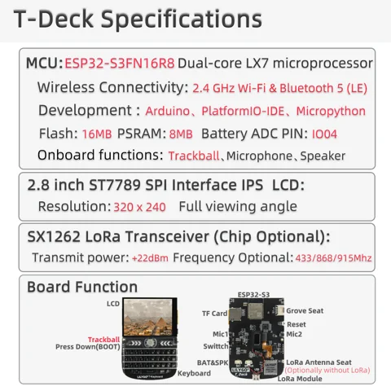

# T-Deck

**LILYGO** · ESP32-S3

Revision: Not identified  
Coverage: Pinout image collected

[Browse all manufacturers](../../../../BROWSE.md) · [Devices & IoT](../../../../DEVICES.md) · [Open in the browser guide](https://valleytech-black-wire-guide.pages.dev/?board=lilygo-gpio-device-t-deck)

Device category: **Handhelds & pocket tools**

## Board pin map

**pinout image** · Reviewed source · JPG

[Open original reference](../../../../library/media/de4ea53827a367c9e2f0db690ded9dd24d08110c868f20f0245c9259f004523f.jpg)

**Credit and rights:** Not established; source attribution retained. Source/manufacturer: LILYGO.

[Source 1](https://wiki.lilygo.cc/products/t-deck-series/t-deck/index/image/t-deck-pin-en.jpg) · [Source 2](https://wiki.lilygo.cc/products/t-deck-series/t-deck/)

Manufacturer image preserved. Match the depicted board and revision before use.

Image revision: Not identified

SHA-256: `de4ea53827a367c9e2f0db690ded9dd24d08110c868f20f0245c9259f004523f`

## Device functions and connector locations

**board labeling image** · Reviewed source · JPG

[Open original reference](../../../../library/media/1083099de7947fc9eb198ef4021b7a2b7d3a8233a5fa5192d5b1fb7078205296.jpg)

**Credit and rights:** Not established; source attribution retained. Source/manufacturer: LILYGO.

[Source 1](https://raw.githubusercontent.com/Xinyuan-LilyGO/documentation/f660c0b15d68a7453ba89e52c2325289493ad4a8/public/products/t-deck-series/t-deck/index/image/t-deck-info-en.jpg) · [Source 2](https://wiki.lilygo.cc/products/t-deck-series/t-deck/)

Original T-Deck overview identifying controls, Grove port and peripherals.

Image revision: Not identified

SHA-256: `1083099de7947fc9eb198ef4021b7a2b7d3a8233a5fa5192d5b1fb7078205296`

Pin assignments have not been independently electrically verified. Check board revision before wiring.
