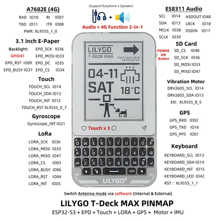

# T-Deck MAX

**LILYGO** · ESP32

Revision: Not identified  
Coverage: Pinout image collected

[Browse all manufacturers](../../../../BROWSE.md) · [Devices & IoT](../../../../DEVICES.md) · [Open in the browser guide](https://valleytech-black-wire-guide.pages.dev/?board=lilygo-gpio-device-t-deck-max)

Device category: **Handhelds & pocket tools**

## Board pin map

**pinout image** · Reviewed source · JPG

[Open original reference](../../../../library/media/65aecec92c0dbd25c65d6e1178b892f41b5f6b45cc0bf5eb38618814da172384.jpg)

**Credit and rights:** Not established; source attribution retained. Source/manufacturer: LILYGO.

[Source 1](https://wiki.lilygo.cc/products/t-deck-series/t-deck-max/index/image/t-deck-max-pinout.jpg) · [Source 2](https://wiki.lilygo.cc/products/t-deck-series/t-deck-max/)

Manufacturer image preserved. Match the depicted board and revision before use.

Image revision: Not identified

SHA-256: `65aecec92c0dbd25c65d6e1178b892f41b5f6b45cc0bf5eb38618814da172384`

Pin assignments have not been independently electrically verified. Check board revision before wiring.
