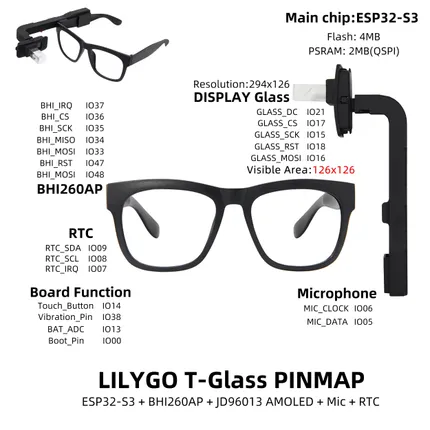
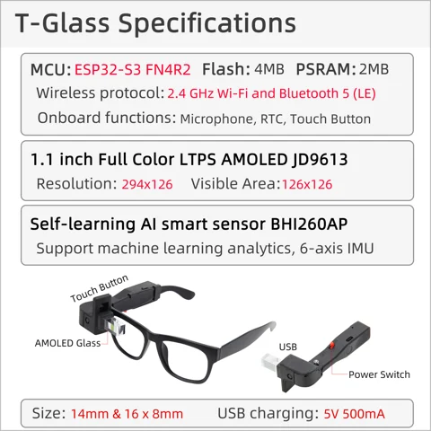

# T-Glass

**LILYGO** · ESP32-S3

Revision: Not identified  
Coverage: Pinout image collected

[Browse all manufacturers](../../../../BROWSE.md) · [Devices & IoT](../../../../DEVICES.md) · [Open in the browser guide](https://valleytech-black-wire-guide.pages.dev/?board=lilygo-gpio-device-t-glass)

Device category: **Wearables**

## Board pin map

**pinout image** · Reviewed source · JPG

[Open original reference](../../../../library/media/77daf1d530660c200a057d4105de975adb83922aac898b3f4b05ef50a182adf6.jpg)

**Credit and rights:** Not established; source attribution retained. Source/manufacturer: LILYGO.

[Source 1](https://wiki.lilygo.cc/products/other/t-glass/index/image/t-glass-pin-en.jpg) · [Source 2](https://wiki.lilygo.cc/products/other/t-glass/)

Manufacturer image preserved. Match the depicted board and revision before use.

Image revision: Not identified

SHA-256: `77daf1d530660c200a057d4105de975adb83922aac898b3f4b05ef50a182adf6`

## Device functions and connector locations

**board labeling image** · Reviewed source · JPG

[Open original reference](../../../../library/media/7f6f424d6420e8923e8fae1eb7b07ffe6072055ac36cefa91347a52bef7d29cc.jpg)

**Credit and rights:** Not established; source attribution retained. Source/manufacturer: LILYGO.

[Source 1](https://raw.githubusercontent.com/Xinyuan-LilyGO/documentation/f660c0b15d68a7453ba89e52c2325289493ad4a8/public/products/other/t-glass/index/image/t-glass-info-en.jpg) · [Source 2](https://wiki.lilygo.cc/products/other/t-glass/)

Original T-Glass overview. Not a T-Glass V2 or V3 pin map.

Image revision: Not identified

SHA-256: `7f6f424d6420e8923e8fae1eb7b07ffe6072055ac36cefa91347a52bef7d29cc`

Pin assignments have not been independently electrically verified. Check board revision before wiring.
