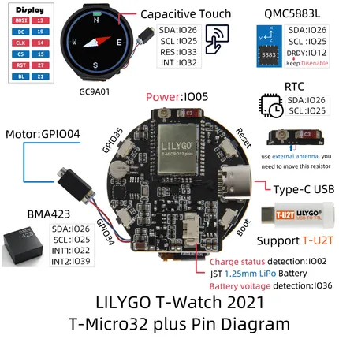

# T-Watch 2021 V1.0

**LILYGO** · ESP32

Revision: V1.0  
Coverage: GPIO reference collected; physical pinout needed

[Browse all manufacturers](../../../../BROWSE.md) · [Desktop app](https://github.com/valleytechsolutions/black-wire-desktop)

## T-WATCH2021-V1.0-en

**GPIO reference image** · Reviewed source · JPG

[Open original reference](../../../../library/media/9d953b27d8df40239f83ecb9deaaa673757b9c07f485ee3a7573f70549dc522d.jpg)

**Credit and rights:** Not established; source attribution retained. Source/manufacturer: LILYGO.

[Source 1](https://raw.githubusercontent.com/Xinyuan-LilyGO/T-Watch-2021/d18ff632c817f4f95f42eb7f2f631a8c28b75294/image/T-WATCH2021-V1.0-en.jpg) · [Source 2](https://github.com/Xinyuan-LilyGO/T-Watch-2021/blob/d18ff632c817f4f95f42eb7f2f631a8c28b75294/image/T-WATCH2021-V1.0-en.jpg)

Internal peripheral GPIO assignments; not a complete external pad/header map.

**Partial diagram. Confirm missing pins against the exact board documentation.**

SHA-256: `9d953b27d8df40239f83ecb9deaaa673757b9c07f485ee3a7573f70549dc522d`

Pin assignments have not been independently electrically verified. Check board revision before wiring.
