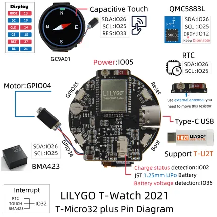
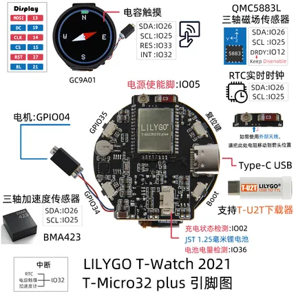

# T-Watch 2021 V1.1

**LILYGO** · ESP32

Revision: V1.1  
Coverage: GPIO reference collected; physical pinout needed

[Browse all manufacturers](../../../../BROWSE.md) · [Devices & IoT](../../../../DEVICES.md) · [Open in the browser guide](https://valleytech-black-wire-guide.pages.dev/?board=lilygo-gpio-device-t-watch-2021-v1-1)

Device category: **Wearables**

## T-WATCH2021-V1.1-en

**GPIO reference image** · Reviewed source · JPG

[Open original reference](../../../../library/media/014a35c31054e231a630ef825e65d158f20c685631cf658ab24a8ea8c649a0e1.jpg)

**Credit and rights:** Not established; source attribution retained. Source/manufacturer: LILYGO.

[Source 1](https://raw.githubusercontent.com/Xinyuan-LilyGO/T-Watch-2021/d18ff632c817f4f95f42eb7f2f631a8c28b75294/image/T-WATCH2021-V1.1-en.jpg) · [Source 2](https://github.com/Xinyuan-LilyGO/T-Watch-2021/blob/d18ff632c817f4f95f42eb7f2f631a8c28b75294/image/T-WATCH2021-V1.1-en.jpg)

Internal peripheral GPIO assignments; not a complete external pad/header map.

Image revision: V1.1

SHA-256: `014a35c31054e231a630ef825e65d158f20c685631cf658ab24a8ea8c649a0e1`

## T-WATCH2021-V1.1-zh

**GPIO reference image** · Reviewed source · JPG

[Open original reference](../../../../library/media/5c4233d910215302d7cbf886417c6913ecba283e96a194a7a501918f48e19bd7.jpg)

**Credit and rights:** Not established; source attribution retained. Source/manufacturer: LILYGO.

[Source 1](https://raw.githubusercontent.com/Xinyuan-LilyGO/T-Watch-2021/d18ff632c817f4f95f42eb7f2f631a8c28b75294/image/T-WATCH2021-V1.1-zh.jpg) · [Source 2](https://github.com/Xinyuan-LilyGO/T-Watch-2021/blob/d18ff632c817f4f95f42eb7f2f631a8c28b75294/image/T-WATCH2021-V1.1-zh.jpg)

Internal peripheral GPIO assignments; not a complete external pad/header map.

Image revision: V1.1

SHA-256: `5c4233d910215302d7cbf886417c6913ecba283e96a194a7a501918f48e19bd7`

Pin assignments have not been independently electrically verified. Check board revision before wiring.
