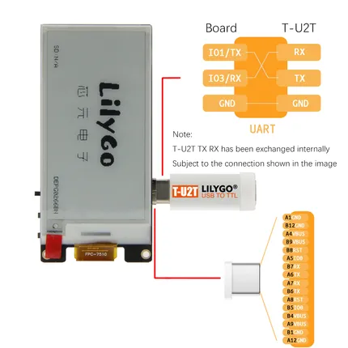

# T-U2T

**LILYGO** · Expansion

Revision: Not identified  
Coverage: Partial pinout collected; full reference still needed

[Browse all manufacturers](../../../../BROWSE.md) · [Desktop app](https://github.com/valleytechsolutions/black-wire-desktop)

## image4

**pinout image** · Reviewed source · JPG

[Open original reference](../../../../library/media/14ac4b37f22a38ba802e7ac7bdcd618163d44853ee79eef4c913f0bba04fe023.jpg)

**Credit and rights:** Not established; source attribution retained. Source/manufacturer: LILYGO.

[Source 1](https://raw.githubusercontent.com/Xinyuan-LilyGO/T-Watch-2021/d18ff632c817f4f95f42eb7f2f631a8c28b75294/image/image4.jpg) · [Source 2](https://github.com/Xinyuan-LilyGO/T-Watch-2021/blob/d18ff632c817f4f95f42eb7f2f631a8c28b75294/image/image4.jpg)

UART adapter orientation and board-to-adapter TX/RX/GND mapping; source warns the adapter TX/RX connection changed. Follow the pictured hardware orientation.

**Partial diagram. Confirm missing pins against the exact board documentation.**

SHA-256: `14ac4b37f22a38ba802e7ac7bdcd618163d44853ee79eef4c913f0bba04fe023`

## image5

**pinout image** · Reviewed source · JPG

[Open original reference](../../../../library/media/9d44341ec992ae0de39122422dc272d31bc3025977f19681756173ab5f1db427.jpg)

**Credit and rights:** Not established; source attribution retained. Source/manufacturer: LILYGO.

[Source 1](https://raw.githubusercontent.com/Xinyuan-LilyGO/T-Watch-2021/d18ff632c817f4f95f42eb7f2f631a8c28b75294/image/image5.jpg) · [Source 2](https://github.com/Xinyuan-LilyGO/T-Watch-2021/blob/d18ff632c817f4f95f42eb7f2f631a8c28b75294/image/image5.jpg)

UART adapter orientation and board-to-adapter TX/RX/GND mapping; source warns the adapter TX/RX connection changed. Follow the pictured hardware orientation.

**Partial diagram. Confirm missing pins against the exact board documentation.**

SHA-256: `9d44341ec992ae0de39122422dc272d31bc3025977f19681756173ab5f1db427`

Pin assignments have not been independently electrically verified. Check board revision before wiring.
