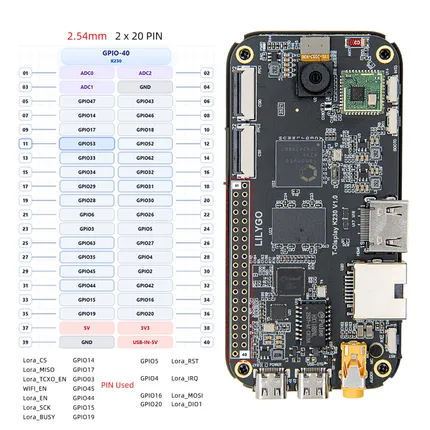
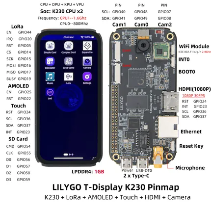

# T-Display K230

**LILYGO** · K230 with ESP32 companion

Revision: Not identified  
Coverage: Pinout image collected

[Browse all manufacturers](../../../../BROWSE.md) · [Desktop app](https://github.com/valleytechsolutions/black-wire-desktop)

## Board pin map

**pinout image** · Reviewed source · JPG

[Open original reference](../../../../library/media/dafb6abe992e70ea1b10e446963ea17efd2c3c2d6e41c2991ea3dd3275527437.jpg)

**Credit and rights:** Not established; source attribution retained. Source/manufacturer: LILYGO.

[Source 1](https://wiki.lilygo.cc/products/t-display-series/t-display-k230/index/image/t-display-k230-40pin.jpg) · [Source 2](https://wiki.lilygo.cc/products/t-display-series/t-display-k230/)

Manufacturer image preserved. Match the depicted board and revision before use.

SHA-256: `dafb6abe992e70ea1b10e446963ea17efd2c3c2d6e41c2991ea3dd3275527437`

## Board pin map

**pinout image** · Reviewed source · JPG

[Open original reference](../../../../library/media/491de1860770625e7866b9687c6c0930bd4e873d06f8eef6e49f0436fb22f943.jpg)

**Credit and rights:** Not established; source attribution retained. Source/manufacturer: LILYGO.

[Source 1](https://wiki.lilygo.cc/products/t-display-series/t-display-k230/index/image/t-display-k230-cn.jpg) · [Source 2](https://wiki.lilygo.cc/products/t-display-series/t-display-k230/)

Manufacturer image preserved. Match the depicted board and revision before use.

SHA-256: `491de1860770625e7866b9687c6c0930bd4e873d06f8eef6e49f0436fb22f943`

Pin assignments have not been independently electrically verified. Check board revision before wiring.
